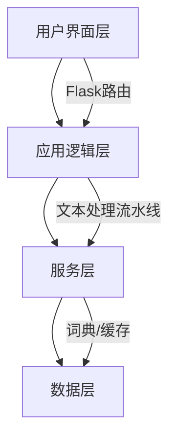
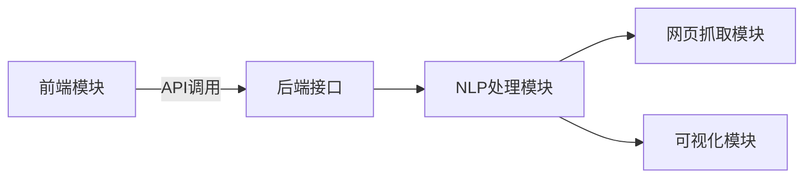
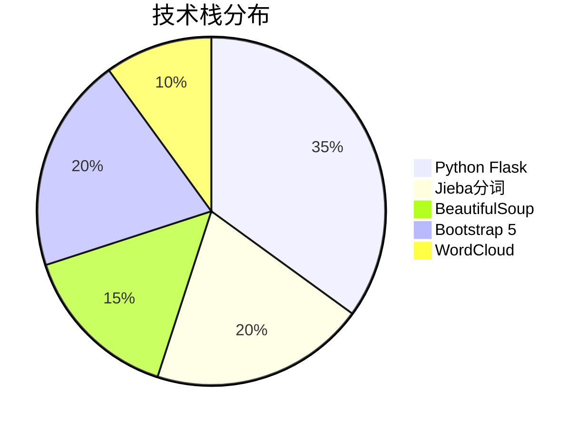
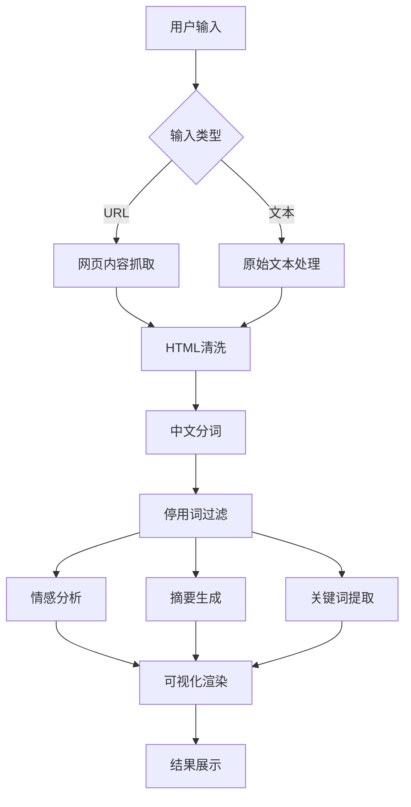
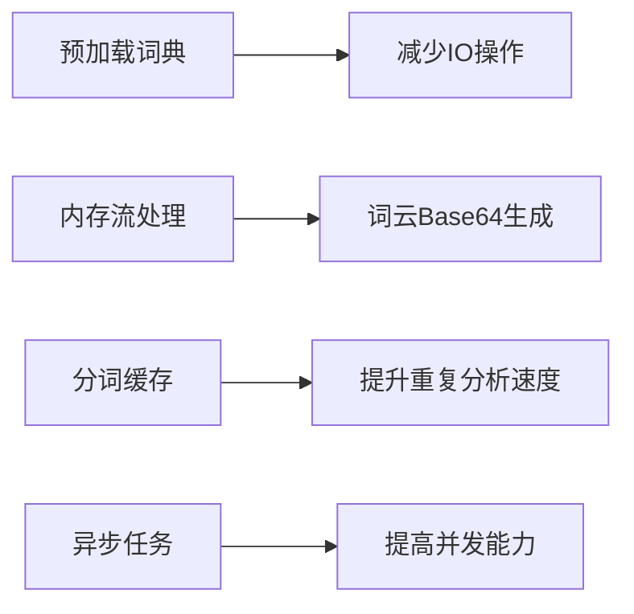
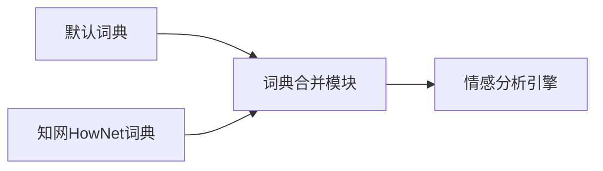
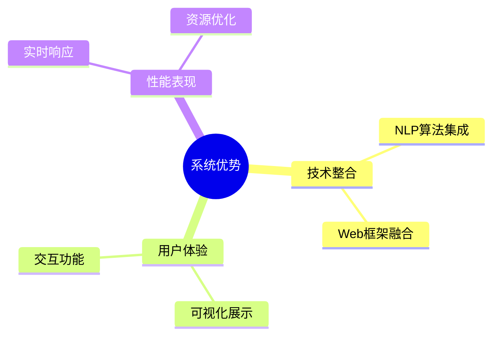

# NLTK-project
# 文本智能分析系统项目

## 项目名称
文本智能分析系统（Text Intelligence Analysis System）

## 项目成员及分工
| 成员             | 分工                              |
|------------------|-----------------------------------|
| 马跃2024303110021 |架构设计、 前后端实现、NLP算法集成与优化、代码整合|
| 姚洁2024303120069 | 需求分析、前端实现|
| 顾瑞莹2024303110020 | 架构设计、前端实现|
| 岳璐璐2024303120074 | 架构设计、前端实现|

## 项目架构
```
NLTK-project/
├── nltk-analyer.py          # 核心代码模块
├── data/                    # 停用词以及知网HowNet情感词典
└── fonts/                   # 字体
```
### 系统分层设计

### 模块结构

## 项目技术路线
### 核心技术栈

### 处理流水线

## 项目实现
### 核心功能模块
 1. 网页采集模块
 2. 文本处理流水线
 3. 情感分析引擎
### 创新特性
 1. 交互式词云系统
 2. 动态进度反馈
 3. 响应式统计卡片
### 性能优化策略

## 技术亮点
1. ​​自适应内容提取​​

* 支持解析主流新闻网站结构
* 智能降级机制保障内容获取

2. ​​多词典情感分析

## 总结
### 项目优势

## 🚀 快速开始

```bash
# 克隆仓库
git clone https://github.com/Gmyue/NLTK-project.git

# 安装依赖
pip install -r requirements.txt

# 运行文本分析
python main/news_analyzer.py
```

#### 本地部署默认网址: http://127.0.0.1:5000

