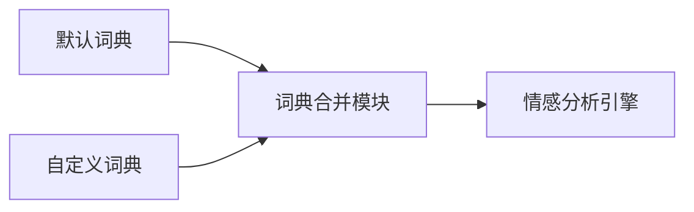

# NLTK-project
# 文本智能分析系统项目总结

## 项目名称
文本智能分析系统（Text Intelligence Analysis System）

## 项目成员及分工
| 成员             | 分工                              |
|------------------|-----------------------------------|
| 马跃2024303110021 | 全栈开发（需求分析、架构设计、前后端实现、NLP算法集成与优化）|
| 姚洁2024303110021 | 前端实现|
| 顾瑞莹2024303110021 | 前端实现|
| 岳璐璐2024303110021 | 前端实现|

## 项目架构
### 系统分层设计

### 模块结构

## 项目技术路线
### 核心技术栈

### 处理流水线

## 项目实现
### 核心功能模块
#### 网页采集模块
#### 文本处理流水线
#### 情感分析引擎
### 创新特性
#### 交互式词云系统
#### 动态进度反馈
#### 响应式统计卡片
### 性能优化策略

## 技术亮点
1. ​​自适应内容提取​​
支持解析主流新闻网站结构
智能降级机制保障内容获取
2. ​​多词典情感分析

## 总结
### 项目优势

